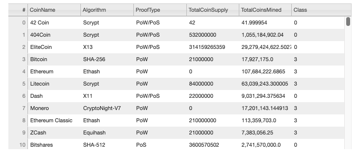
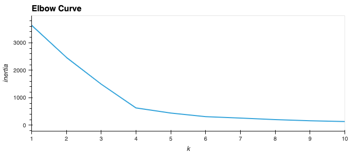
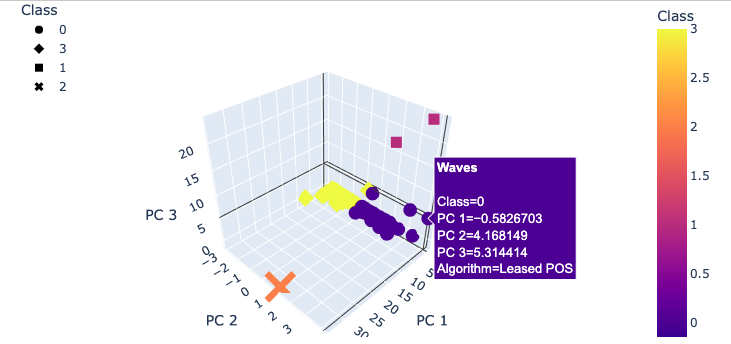
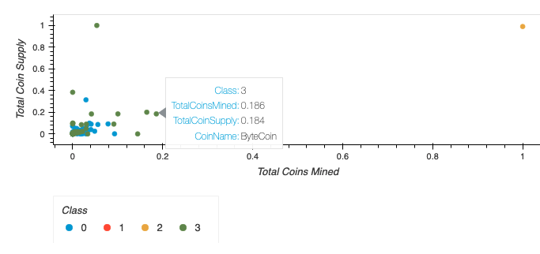

# Cryptocurrencies

## Overview
This project is a starting point for unsupervised machine learning. Specifically utilizing skills in data processing, clustering, reducing dimensions, and reducing principal components. The final result is a clean dataset with 532 tradeable cryptocurrencies visualized with tables, scatterplots and 3D scatterplots. All analysis is written in Python.

---
### Resources
* Source Code: [Crypto Currency](crypto_clustering.ipynb)
* Source Data: [CryptoCompare](Resources/crypto_data.csv)
* Technology: [scikit-learn](https://scikit-learn.org/stable/), [hvPlot](https://hvplot.holoviz.org/index.html)

---
### Deliverables
- [x] Deliverable 1: Preprocessing the Data for PCA
- [x] Deliverable 2: Reducing Data Dimensions Using PCA
- [x] Deliverable 3: Clustering Cryptocurrencies Using K-means
- [x] Deliverable 4: Visualizing Cryptocurrencies Results 

---
### Processed Data

### Clustering Data

### 3D Scatterplot

### Scatterplot

